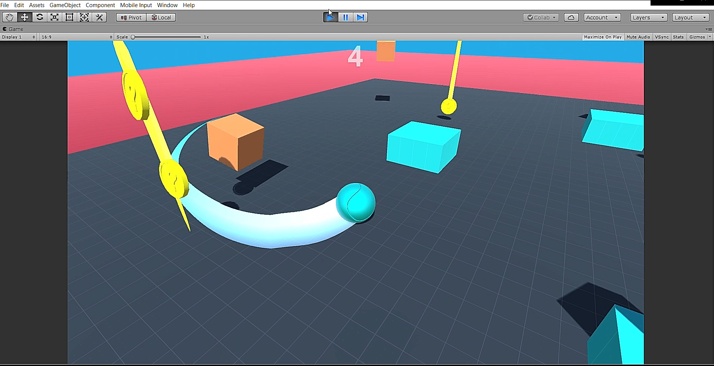
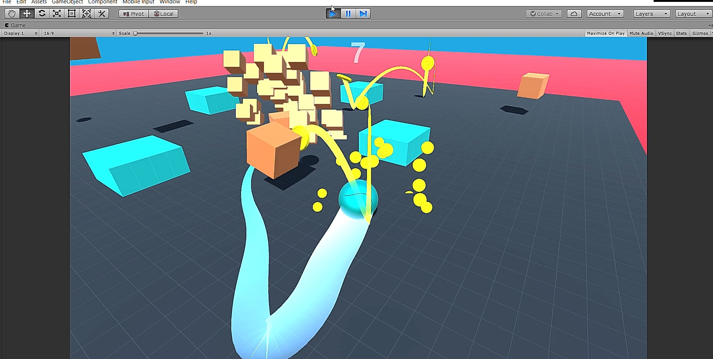
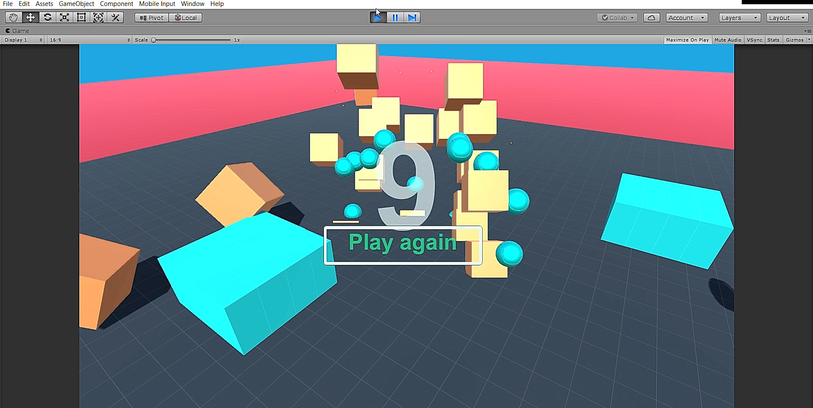

# Roller Madness Game In Unity 3D:

Roller Madness game is all about moving a rolling ball with full control avoiding the obstacles and without 
falling outer game surface. In this game, the player has to control the rolling ball in order to collect
yellow coins. There are some cubes which make the ball bounce back. The cube boxes fall to the game surface
and it tries to stop the ball. 
Where ever the ball moves, the boxed cubes follow and if it touches the ball then the game is over.

The player controls a ball in a three dimensional world that is moved to collect
randomnly spawning coins while navigating through obstacles. All this while, contact with 
enemy boxes needs to be avoided. The enemies can only be destroyed by bringing them in contact with 
each other. The game
finishes when the players falls off the stage, or touches an enemy box.

Screenshots
-----------

